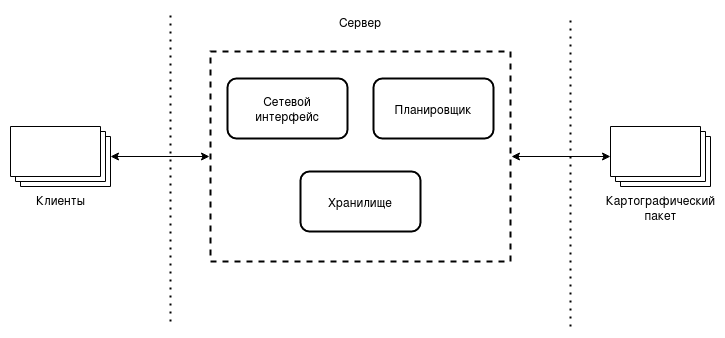
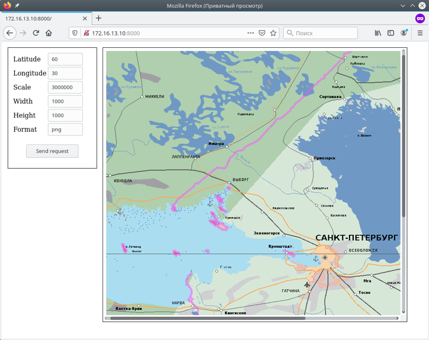
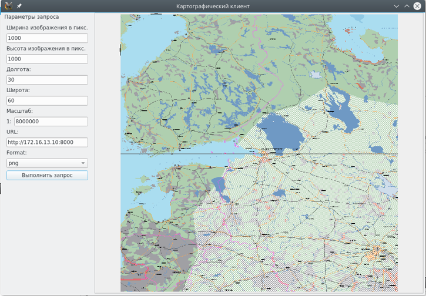

# gis-map-server
Веб-сервис для распространения и тестовый клиент для отображения картографической информации. 

[gis-map-server](src/gis-map-server/) - Python веб-сервер

[gis-client-render](src/gis-client-render) - Qt клиент для отображения

Архитектура проекта:


Сервис принимает запросы на отрисовку региона средствами [ПК ЦКИ](https://kpda.ru/products/gis/) и возвращает отрисованную карту в виде картинки (поддерживаемые выходные форматы: bmp, png, jpeg).

Для сборки необходимо:
```
cd src
# Единожды сформировать файл переводов
lrelease gis-client-render/*pro
# Для сборки под архитектуру _cpu_ можно установить CPULIST=_cpu_, например x86 
make install
```
В результате в корне проекта появится папка `.install`, в которую инсталлируются runtime-компоненты

При запуске веб-сервер `gis-map-server` считывает [конфигурационный файл](src/gis-map-server/gis-map-server.conf).
`gis-map-server` предоставляет веб-интерфейс, внешний вид которого показан на рисунке 1.



Внешний вид Qt-клиента показан на рисунке 2.


